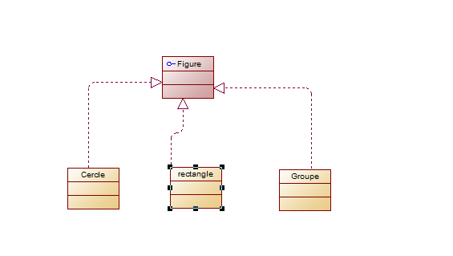
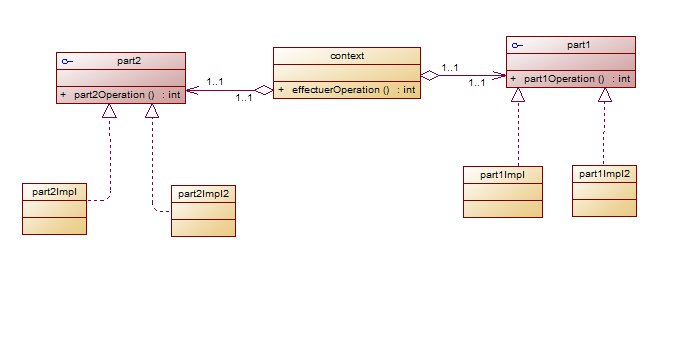
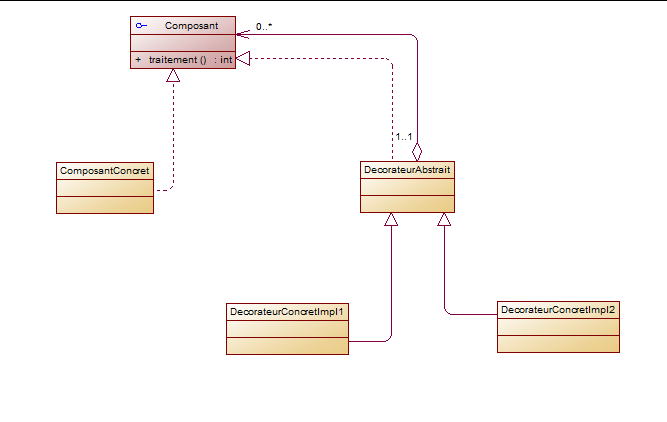
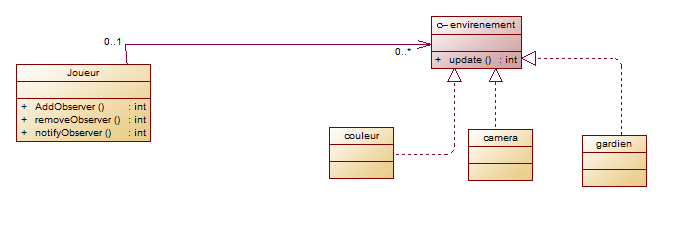
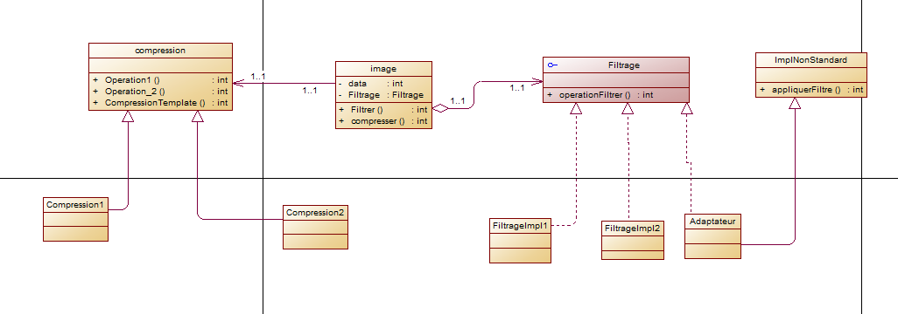

##  Creation du web service  

## 1- Une figure peut être soit un cercle, un rectangle ou un groupe de figures.

## 2-  Un plugin contient une opération implémentant le squelette d’un algorithme dont deux parties (partie1 et partie2) sont variables. On voudrait laisser le développeur la possibilité d’implémenter les deux parties manquantes de cet algorithme et on voudrait aussi que l’application cliente puisse instancier une implémentation concrète du plugin sans connaitre sa classe d’implémentation.

## 3- On dispose d’un composant implémentant une interface qui définir une opération «traitement() ». On voudrait rattacher à ce composant des responsabilités supplémentaires sans modifier son code source. C'est-à-dire envelopper l’exécution de la méthode traitement par d’autres traitements avant et après son exécution.

## 4- On désire créer une classe Joueur ayant un état représenté par une variable score de type int. On voudrait que les objets de l’environnement du jeu (Couloir, Caméra et Gardien) soient informés à chaque fois que le score du joueur change tout en gardant un couplage faible entre la classe Joueur et les autres classes.

## Exercice 2 :
